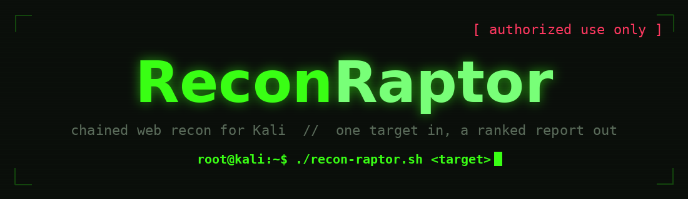
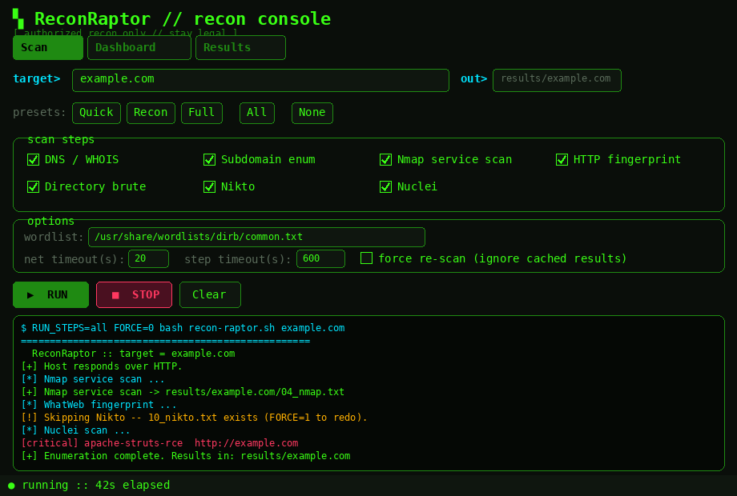
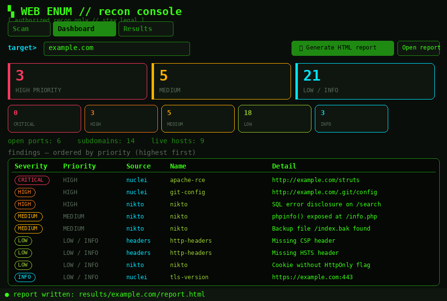
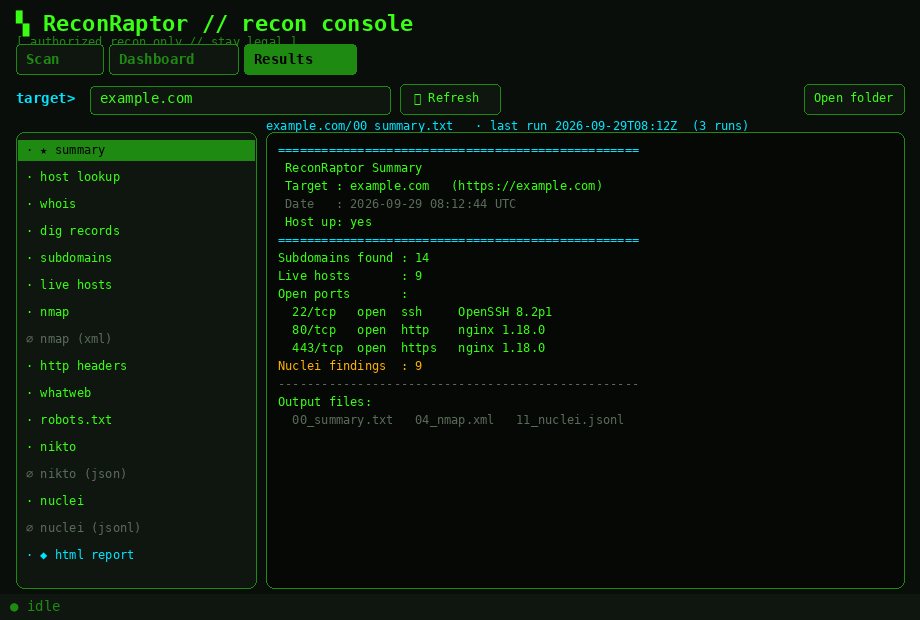
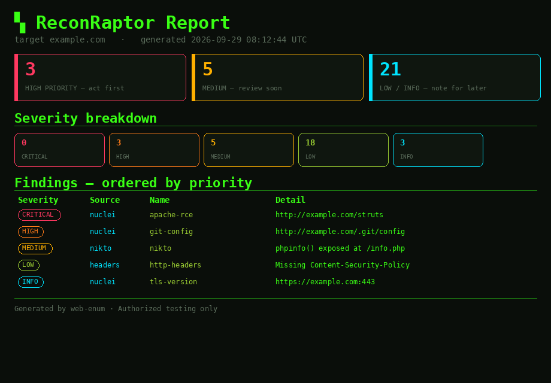

<div align="center">



<br><br>


</div>

---

> ```
> [!] AUTHORIZED USE ONLY
> ```
> Run these **only** against systems you own or have **explicit written
> permission** to test. Unauthorized scanning is illegal.

**ReconRaptor** chains the common recon tools (`nmap`, `whatweb`, `curl`,
`gobuster`/`feroxbuster`, `nikto`, `nuclei`, `subfinder`/`httpx`) into a single
run, saves every step to a per-target folder, and rolls the findings up into a
severity-ranked HTML + JSON report — from the CLI or a dark, terminal-style GUI.

---

## ▚ Screenshots

<div align="center">

**Scan** — presets, per-step toggles, options, live colour-coded output


**Dashboard** — priority cards, severity tiles, findings ranked highest-first


**Results** — browse every output file inline, colour-coded


**HTML report** — self-contained, shareable, ranked by what to fix first


</div>

> These are theme-accurate mockups. To drop in real captures, run the GUI and
> overwrite the files in `docs/screenshots/` (e.g. `import -window root docs/screenshots/scan.png`).

---

## ▚ Install (fresh Kali box)

```console
# 1. Core tools (most ship with Kali; this makes sure)
$ sudo apt update
$ sudo apt install -y nmap whatweb curl nikto gobuster ffuf \
      dnsutils whois python3-tk seclists

# 2. Go-based recon tools (if not already present)
$ sudo apt install -y subfinder httpx-toolkit nuclei   # or install via `go install`

# 3. Update nuclei templates (first run only)
$ nuclei -update-templates

# 4. Grab ReconRaptor and make the scripts executable
$ git clone <your-repo-url> reconraptor   # or unzip the release
$ cd reconraptor
$ chmod +x recon-raptor.sh oneliner.sh

# 5. Sanity check
$ python3 -m unittest discover -s tests
```

Missing tools are skipped gracefully — you don't need every one of them.

---

## ▚ Quick start

```console
# Full run (writes results/<host>/)
$ ./recon-raptor.sh example.com
$ ./recon-raptor.sh https://10.10.10.10 results/box1

# Quick one-liner chain
$ ./oneliner.sh 10.10.10.10

# GUI (desktop app)
$ python3 recon-raptor-gui.py
```

Results land under `results/<host>/`, with `00_summary.txt` as the roll-up.

---

## ▚ GUI

A dark, terminal-style front-end for `recon-raptor.sh` with three tabs.

**`Scan`**
- Enter the **target** (Enter runs it) and, optionally, an **output dir**.
- One-click **presets** — `Quick` (http/nmap/dirb), `Recon` (dns/subs/http),
  `Full` — or tick individual **steps** (All / None too).
- An **options** panel for wordlist, network/step timeouts, and force re-scan.
- **Run** streams **colour-coded** output live with an elapsed timer; **Stop**
  SIGTERMs the whole process group, escalating to SIGKILL if it hangs.

**`Dashboard`**
- Priority cards — **HIGH** (critical+high), **MEDIUM**, **LOW/INFO** — plus
  per-severity tiles and asset counts (open ports, subdomains, live hosts).
- A **findings table ordered by severity**, parsed from Nuclei, Nikto, and
  HTTP security-header checks.
- **Generate HTML report** → self-contained `report.html` (+ `report.json`);
  **Open report** launches it in your browser.

**`Results`**
- Pick a target; every output file is listed with a friendly name
  (empty files marked `∅`). Click to read inline, colour-coded. Shows last-run
  time from `.runs.log`.

Requires `python3-tk` (`sudo apt install python3-tk` — usually preinstalled on Kali).

---

## ▚ Reports (standalone)

```console
$ python3 report.py results/example.com          # -> report.html + report.json
$ python3 report.py results/example.com out.html  # custom path (+ out.json)
$ python3 report.py results/example.com --json    # JSON only
```

`report.py` prefers structured tool output — `04_nmap.xml`, `10_nikto.json`,
`11_nuclei.jsonl` — and falls back to parsing the plain-text files, so reports
from older result folders still work. Findings are bucketed into
**HIGH PRIORITY / MEDIUM / LOW-INFO** so you see what to act on first.

Pick which steps run via the `RUN_STEPS` env var (comma-separated tokens
`dns,subs,nmap,http,dirb,nikto,nuclei`, or `all`) — the GUI sets this, and the
CLI honours it too:

```console
$ RUN_STEPS=nmap,nuclei ./recon-raptor.sh target.tld
```

---

## ▚ Customizing

```console
# Different wordlist
$ WL_DIR=/usr/share/wordlists/dirbuster/directory-list-2.3-medium.txt ./recon-raptor.sh target.tld

# Tune timeouts (seconds): per-request, hard cap per step, nikto's own budget
$ NET_TIMEOUT=30 STEP_TIMEOUT=900 NIKTO_TIMEOUT=300 ./recon-raptor.sh target.tld

# Resume a partial run (skips completed steps) ...
$ ./recon-raptor.sh target.tld
# ... or force a full re-scan
$ FORCE=1 ./recon-raptor.sh target.tld
```

Every run appends to `results/<host>/.runs.log` (timestamp, steps, resolved URL)
and rewrites `results/<host>/00_summary.txt`.

---

## ▚ Files

| File | What it does |
|------|--------------|
| `recon-raptor.sh` | Full pipeline: reachability check (HTTPS auto-probe), DNS/whois, subdomain enum, nmap, HTTP fingerprint, robots, dir brute, nikto, nuclei, plus a `00_summary.txt` roll-up. Per-step timeouts; skips missing tools gracefully; **resumes** completed steps (`FORCE=1` to redo). Emits **structured output** (nmap XML, nikto JSON, nuclei JSONL) alongside human-readable text. |
| `oneliner.sh` | Compact chain (subdomains + nuclei) for quick runs; guards each tool. |
| `recon-raptor-gui.py` | Hacker-themed Tkinter console (Scan / Dashboard / Results) with presets, an options panel, colour-coded live output, a severity dashboard, and one-click HTML report. Wraps `recon-raptor.sh`. |
| `report.py` | Parses a results folder (prefers structured output, falls back to text), ranks findings by severity, renders a self-contained HTML report **and** a machine-readable `report.json`. |
| `tests/` | `unittest` suite for `report.py`'s parsers. |

---

## ▚ Requirements (all standard on Kali)

- `nmap`, `whatweb`, `curl`, `nikto`
- `gobuster` **or** `feroxbuster` for content discovery
- `dnsutils` / `whois` for DNS lookups
- `subfinder` / `assetfinder` (passive) **or** `ffuf` (active DNS brute) + `httpx`
- `nuclei` for template scanning (`nuclei -update-templates` first)
- Wordlist at `/usr/share/wordlists/dirb/common.txt` (override `WL_DIR=…`)
- Subdomain wordlist for the ffuf fallback (override `SUB_WL=…`)

---

## ▚ Tests

```console
$ python3 -m unittest discover -s tests -v
```

Covers the report parsers: structured (nmap XML / nikto JSON / nuclei JSONL),
text fallback, header checks, and severity-inference edge cases.

---

## ▚ License

[MIT](LICENSE) — for authorized security testing only.

---

<div align="center">
<sub><code>stay legal // scan only what you're allowed to</code></sub>
</div>
